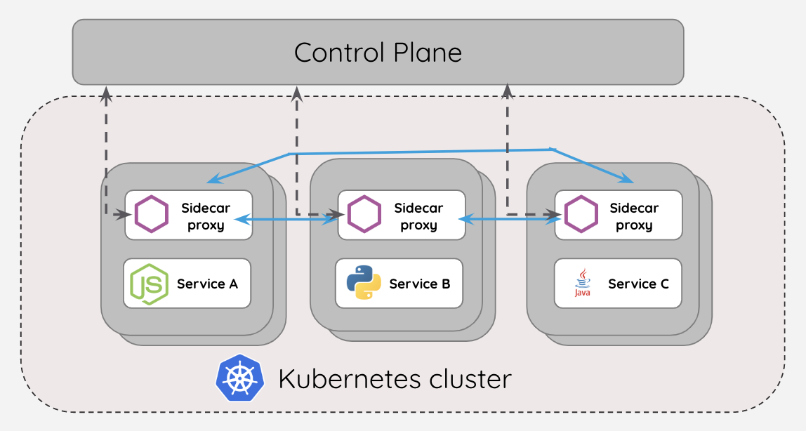

**What is API versioning?**
API versioning is a method for managing changes to an API over time. 
As APIs grow to meet new business demands, embrace new technologies, or address bug fixes, 
they must be carefully updated to ensure that existing clients can continue to work while new 
features and improvements are enabled.

**When do we think to do API versioning**
-----------------------------------------

when you want to give some additional business or new customer experience to few customers not all but 
also want to keep old business with old customers.Then upgrading the existing version might be 
breaking change so you don't want to touch existing business and want to update the business for new customers 
then add versioning will work here so it will be no impact on old customer and new customers can also have new experience.

**How many types of API Versioning**
-----------------------------------
API Versions can be send in below format-
Header
Request param
Path param
Hybrid approach - 2 or more strategy either request param or URI or header

**Why API Versioning required**
-------------------------------
Introducing breaking changes (e.g., removing a field, modifying response formats) can 
disrupt client applications.

Versioning enables gradual adoption of new features while maintaining older versions for 
clients that need stability.

Different consumers (mobile apps, web apps, third-party integrations) may have 
dependencies on different API versions.

Deprecate old versions gradually, giving clients time to migrate.

**what is service mesh**
-------------------------
A service mesh is a software layer that handles all communication between services in applications.
This layer is composed of containerized microservices. 
As applications scale and the number of microservices increases, it becomes challenging to monitor 
the performance of the services. To manage connections between services, a service mesh provides 
new features like monitoring, logging, tracing, and traffic control.

**Service Mesh Architecture**
-----------------------------

Following is the Service Mesh Architecture

Control Plane - Manages the layer of security and communication rules.
                it works as route53 table in AWS Cloud.
Data plane - sidecars for each service to communicate and transforming the routes.

One of the most popular service mesh is Istio.

**Between API Gateway and Service Mesh**
-----------------------------------------

1. API Gateway follows north south Pattern and looks after authentication and authorisation while 
    a service mesh handles functions like load balancing and encryption between services.
2. The service mesh is in its own unique instance as a sidecar proxy, and it is not exposed to external clients 
   but API gateways are exposed to external clients.
3. Service mesh only handles communication between services that make up a system, 
    while an API gateway decouples the underlying system from the API that is exposed to 
    clients (which can be other systems within the organization or external clients).

**Microservice Design Patterns**
--------------------------------
1. API Gateway - Centralized control for orchestration, log monitoring , error handling
2. Circuit Breaker - To avoid multiple calls in case any service is down.
3. Saga - The saga pattern is used to ensure data consistency across multiple services in a microservices architecture.
   In traditional monolithic systems, transactions are usually managed using a two-phase commit.
   The saga pattern proposes an alternative solution. It suggests breaking a transaction into multiple local transactions.
   Each local transaction updates data within a single service and publishes an event.
   Other services listen to these events and perform their local transactions.
   If a local transaction fails, compensating transactions are executed to undo the changes.
4. Command Query Responsibility Segregation (CQRS)
6. Service Registry - centralized place where are services registered to discover any service
   by service discovery this can be used.
7. Event-Driven Architecture
8. Domain Driven Architecture
9. service discovery  - Using Eureka(Used in Barclays)

**Which API Gateways are used in Barclays**
--------------------------------------------
Zuul API Gateway is being used(Spring Cloud Libraries)
Zuul is built to enable dynamic routing, monitoring, resiliency, and security.

**What is eureka server**
--------------------------
Eureka server is used in barclays which contains all information of client and service details
It's a kind of service discovery utility

**CQRS Microservices Design Pattern**
-------------------------------------
    Command Query Responsibility Segregation - 
    
    * Means Write and Read both from separate DB.
      * Write in one DB like MYSQL ---> publish event to event store--->Event store is subscribed by 
        another MONGO db(NO SQL) --->Same data is saved in Mongo DB
      * When Read happens data is fetched from Mongo DB.
    
    **Benefits**
    ------------
    1. it provides clear separation of roles making both operations isolated.
       2. it is beneficial when seperate scaling is needed for reading and writing optimzing both the 
          operations effectively.
       3. All events can be stored in event store for future audit purpose.
    
    **Where can we leverage CQRS**
    ------------------------------
    High-traffic microservices with frequent reads/writes (e.g., e-commerce, banking).
    
    Systems requiring separate scalability for read and write operations.
    
    Event-driven architectures where real-time data updates are needed.

**SAGA**
--------

**Difference between domain driven and event driven architecture in microservices**
-----------------------------------------------------------------------------------

**When to Use DDD for Microservices-->**
----------------------------------------
**Complex Domains:**
--------------------
If your application deals with intricate business logic and requires a deep understanding of the
domain, DDD can provide a structured approach to model and implement the system.

**Large Systems:**
------------------
When you're building a microservices architecture with multiple services,
DDD can help define clear boundaries and interactions between these services, promoting
modularity and scalability.

**Aligning with Business Logic:**
---------------------------------
DDD encourages aligning software design with business requirements,
ensuring that each microservice encapsulates a specific business capability.

**Decomposing Monoliths:**
--------------------------
If you're migrating a monolithic application to a microservices architecture,
DDD can help identify logical boundaries and ensure each microservice remains cohesive.

**When to use Event Driven Architecture**
-----------------------------------------
Event-driven design for microservices is best suited for scenarios involving real-time processing,
high concurrency, and complex event handling, such as IoT applications, real-time analytics, and systems
requiring asynchronous communication and coordination between teams or different regions.

**What is GRAPHQL**
-------------------
GraphQL is a query language and API specification for building client applications, while
RAML (RESTFUL API Modeling Language) is a specification for defining RESTFUL APIs.
GraphQL focuses on efficient data fetching, while RAML is designed for API design and
documentation.
