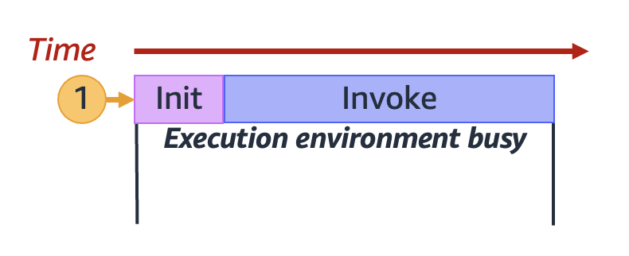
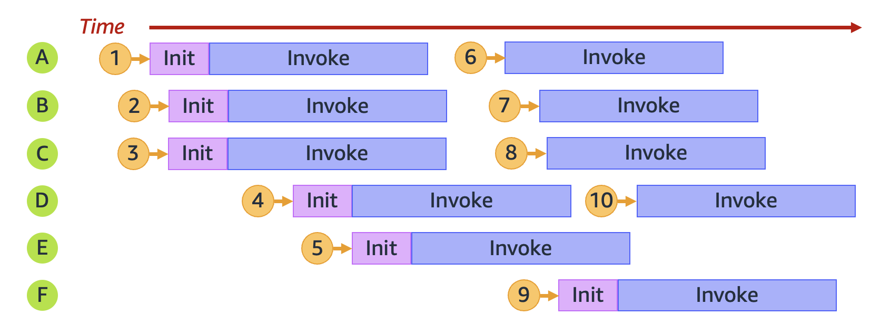
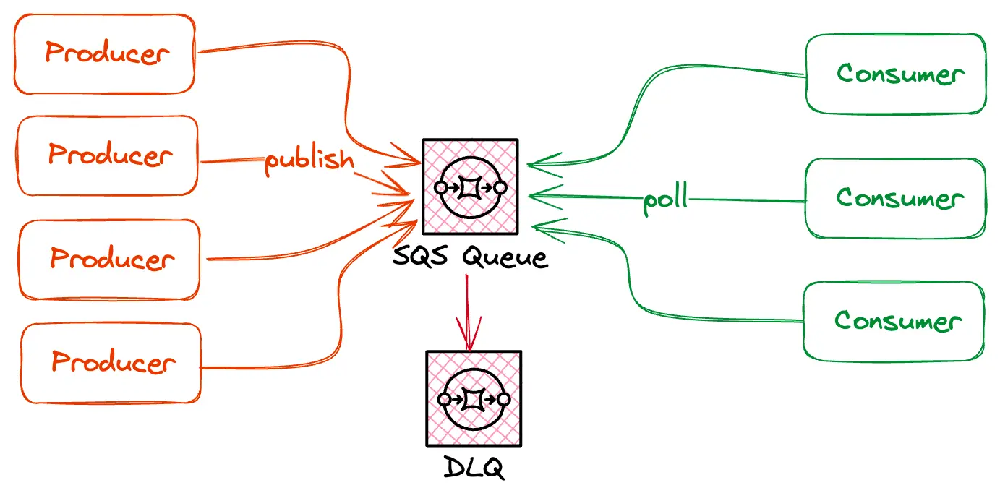
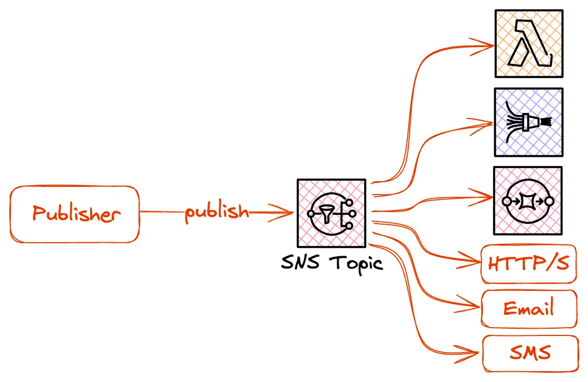

**How will you make your application more scalable on high traffic day?**
-------------------------------------------------------------------------

Put your VMs or ECS in autoscaling group and use Load balancer but since cloud is much more 
matured now so we can now use 
more add ons to manage high traffic.Using load balancer and autoscaling group only will not 
keep up scaling my EC2 so below add ons can be used.

During Big traffic event we can-
1. Prewarm load balancer - 
2. Scheduled scaling for my autoscaling -
3. Use lightweight AMI for EC2 - The more unnecessary libraries in AMI more time will will take to spin up or scale for EC2. So better to take light weight AMIs.
4. Use RDS proxy to create new connections as high traffic will come. 
   RDS proxy will use data base connection pooling if lot of connections are open and then as 
   per usage will reuse them instead creating new one. RDS Proxy manages the connection pooling, 
   security , high availability.
5. run IEM to handle high traffic - to explore

**Lambda Autoscaling**
----------------------
Concurrency is the number of in-flight requests that your AWS Lambda function is handling at the same time. 
For each concurrent request, Lambda provisions a separate instance of your execution environment. As your functions receive more requests, 
Lambda automatically handles scaling the number of execution environments until you reach your account's concurrency limit.

By default, Lambda provides your account with a total concurrency limit of 1,000 concurrent executions across all functions in an AWS Region.
To support your specific account needs, you can request a quota increase and configure 
function-level concurrency controls so that your critical functions don't experience throttling.

    **Understanding and visualizing concurrency**

Lambda invokes your function in a secure and isolated execution environment. To handle a request, Lambda must first initialize an execution environment 
(the Init phase), before using it to invoke your function (the Invoke phase):

    **Execution Environment Creation**

As mentioned in the diagram only 6 instances of execution environment is created for 10 request.
Execution environment is created if no instances are available else reuse the available execution environment.

**AWS Lambda Execution Time Limit**
-----------------------------------
AWS Lambda has a configurable maximum execution time limit of up to 15 minutes. If this limit is reached, 
the function will be stopped forcefully by AWS. This means that long-running processes are not easily possible 
with Lambda

    **Understanding reserved concurrency and provisioned concurrency**
--------------------------------------------------------------------------

By default, your account has a concurrency limit of 1,000 concurrent executions across all functions in a Region.
Your functions share this pool of 1,000 concurrency on an on-demand basis.
Your functions experiences throttling (that is, they start to drop requests) if you run out of available concurrency.

There are two types of concurrency controls available: reserved concurrency and provisioned concurrency.

**reserved concurrency**
------------------------

* Use **reserved concurrency** to reserve a portion of your account's concurrency for a function. 
* This is useful if you don't want other functions taking up all the available unreserved concurrency.
* When you dedicate reserved concurrency to a function, no other function can use that concurrency.

**Provisioned concurrency**
----------------------------

Use **provisioned concurrency** to pre-initialize a number of environment instances for a function. 
This is useful for reducing cold start latencies.

if you have 1000 concurrency limit and you have provisioned 400 units of provisioned concurrency to one lambda it means that
lambda can use 400 units of provisioned concurrency but if in case more request then it has to use 
unprovisioned concurrency but with cold start problem.

* You use reserved concurrency to define the maximum number of execution environments reserved for a Lambda function. 

* However, none of these environments come pre-initialized. As a result, your function invocations may take longer 
    because Lambda must first initialize the new environment before being able to use it to invoke your function. 
    When Lambda has to initialize a new environment in order to carry out an invocation, this is known as a cold start. 
    To mitigate cold starts, you can use provisioned concurrency.

* Provisioned concurrency is the number of pre-initialized execution environments that you want to allocate to your 
  function. If you set provisioned concurrency on a function, Lambda initializes that number of execution 
  environments so that they are prepared to respond immediately to function requests.

* Using provisioned concurrency incurs additional charges to your account.

MAE -In MAE project no reserved concurrency is configured only Unreserved concurrency is mentioned with 950 Limit

**Difference between SQS and SNS**
----------------------------------

SQS and SNS are part of the core of Amazon's serverless offering.

**SQS**
-------

Saves messages in a queue and waits for them to be picked up. SQS is a pull-based service that scales 
elastically.
SQS uses queues to publish messages

The message remains in the queue for a defined time (by default 4 days, maximum 14 days)
SQS offers many capabilities for retrying messages with its redrive policy. You can define several 
retries and a dead letter queue in case messages are failing. 
Dead letter queues (DLQ) are used to handle messages with errors.
Relation Ships - Many to One
When Notification reached to Microservices , messages are polled from SQS.

**SNS**
-------

Forward messages to subscribed consumers. SNS is a pub/sub service that uses topics to separate 
messages into channels.
SNS uses topics to publish messages
Relation Ships - Many to Many

SNS uses A2A or A2P sending methods
A2A -Application to Application.Destination are AWS Lambda,SQS 
A2P - Application to person.Destination are SMS and Emails.

**FAN Out Design Pattern**
--------------------------

FAN Out Design Pattern uses asynchronous communications between microservices
Loosely coupled communications between different systems.

Guide to understand FAN OUT Design Pattern

https://medium.com/aws-lambda-serverless-developer-guide-with-hands/publish-subscribe-fan-out-pattern-in-serverless-architectures-using-sns-sqs-and-lambda-bccaa3abac9e

**DLQs**
--------

When there is any failure in publishing any message to SNS then messages is delivered to DLQ topic
Once DLQ recieved failed messages ,RTB team manually re-triggered messages.

**Microservice Design Patterns**
--------------------------------
1. API Gateway - Centralized control for orchestration, log monitoring , error handling 
2. Circuit Breaker - To avoid multiple calls in case any service is down.
3. Saga - The saga pattern is used to ensure data consistency across multiple services in a microservices architecture.
   In traditional monolithic systems, transactions are usually managed using a two-phase commit.
   The saga pattern proposes an alternative solution. It suggests breaking a transaction into multiple local transactions. 
   Each local transaction updates data within a single service and publishes an event. 
   Other services listen to these events and perform their local transactions. 
   If a local transaction fails, compensating transactions are executed to undo the changes.
4. Command Query Responsibility Segregation (CQRS)
6. Service Registry - centralixed place where are services registered to discover any service 
by service discovery this can be used. 
7. Event-Driven Architecture
8. Domain Driven Architecture

**Difference between domain driven and event driven architecture in microservices**
-----------------------------------------------------------------------------------

**When to Use DDD for Microservices-->**
----------------------------------------
**Complex Domains:**
--------------------
If your application deals with intricate business logic and requires a deep understanding of the 
domain, DDD can provide a structured approach to model and implement the system.

**Large Systems:**
------------------
When you're building a microservices architecture with multiple services, 
DDD can help define clear boundaries and interactions between these services, promoting 
modularity and scalability.

**Aligning with Business Logic:**
---------------------------------
DDD encourages aligning software design with business requirements, 
ensuring that each microservice encapsulates a specific business capability.

**Decomposing Monoliths:**
--------------------------
If you're migrating a monolithic application to a microservices architecture, 
DDD can help identify logical boundaries and ensure each microservice remains cohesive. 

**When to use Event Driven Architecture**
-----------------------------------------
Event-driven design for microservices is best suited for scenarios involving real-time processing, 
high concurrency, and complex event handling, such as IoT applications, real-time analytics, and systems 
requiring asynchronous communication and coordination between teams or different regions. 

**What is GRAPHQL**
-------------------
GraphQL is a query language and API specification for building client applications, while 
RAML (RESTFUL API Modeling Language) is a specification for defining RESTFUL APIs. 
GraphQL focuses on efficient data fetching, while RAML is designed for API design and 
documentation.

**AWS Cloud Migration Techniques**
----------------------------------
Migration from on premises to AWS Cloud
You can migrate any workload – applications, websites, databases, storage, physical or virtual 
servers – and even entire data centers from an on-premises environment.
<TBC>

**Java 17 features**
--------------------
1. Pattern Matching for Switch (Preview) - we can use type also as given below
------------------------------------------------------------------------------

    public String checkObject(Object obj) {
            return switch (obj) {
            case Human h -> "Name: %s, age: %s and profession: %s".formatted(h.name(), h.age(), h.profession());
            case Circle c -> "This is a circle";
            case Shape s -> "It is just a shape";
            case null -> "It is null";
            default -> "It is an object";
        };
    }

2. Sealed Classes
-----------------

    The syntax for declaring a sealed class involves using the sealed modifier before the class keyword. 
    Additionally, you need to specify which subclasses are allowed to extend the sealed class using 
    the permits keyword followed by the list of permitted subclasses.
    
    Here’s an example:
    
    public sealed class Shape permits Circle, Square, Triangle {
    // Class members and methods
    }
    
    
    * Sealed classed can helps to maintainability and encapsulation of code
      * It also ensures that unnecessary classes cannot inherit the super class.

**Difference between BDD and TDD**
----------------------------------
BDD uses tools like Cucumber or SpecFlow to write tests in a "Given-When-Then" format, 
making the specifications executable and verifiable.
Feature Files:
--------------
These files, often written in Gherkin syntax, define user stories and scenarios, outlining 
the desired behavior of the software.
Step Definitions:
-----------------
These map the Gherkin steps to actual test code, linking the human-readable language with 
executable tests.
Reporting Tools:
----------------
These tools visualize test results and track progress, offering insights into the health and 
stability of the application. 

**TDD (Test-Driven Development)**
---------------------------------
Focuses on writing tests before code, ensuring functionality and 
aiding in design, while BDD (Behavior-Driven Development) emphasizes system behavior from a user 
perspective, promoting collaboration and using natural language.

**Idempotent**
--------------
GET , PUT, HEAD,DELETE
These methods are considered as idempotent as no effect on repeated invocation call.

POST and PATCH are considered as not Idempotent as repeated invocation can 
lead to multiple record creation.

**How to Monitor AWS Lambda Response time**
-------------------------------------------

AWS X Ray - This is used to monitor real time metrics of performance and response time for 
serverless applications in distributed enviornment.

Use AWS X-Ray for end-to-end tracing, CloudWatch Logs for detailed insights into execution, 
and CloudWatch metrics for overall performance analysis, including invocation duration and 
error rates.

AWS Lambda automatically sends metrics to CloudWatch, including invocation duration, error rates, 
and concurrency.

**How can you improve AWS Lambda performance Issues**
------------------------------------------------------

Focus on optimizing memory allocation, minimizing cold starts, reducing package size, and 
utilizing features like provisioned concurrency and connection reuse.

For Example in MAE project we have done these things

**Lambda Layers:**
Use Lambda Layers to share code and dependencies between multiple functions, reducing deployment 
artifact size and improving cold start times. when you will open your lambda in AWS you will layers info 
in layers.

**Provisioned Concurrency:**
Allocate pre-initialized execution environments to your function, ready to respond to incoming 
requests immediately. Be aware that this incurs additional charges. 

**Reduce Package Size**
Keep your package as light as possible to move and work lambda faster.
Move any shared code or functionality to common lambda layer like JKS file or pem file to common
lambda layer

**Optimize memory allocation**
Allocate more memory to your lambda but not too much only that is required but incase of performance
issue increase little bit of memory and check the performance you will get it.

Memory is like fuel for your lambda

in MAE project for one of the AIP Lambda we have allocated this much memory
Memory - 2048 MB
Ephemeral Memory - 512MB

**Minimize Cold Starts**
Allocate some provisioned concurrency to get rid of cold start problem.

**Leverage AWS X-Ray for tracing**
Using AWS X-Ray for tracing helps you make your AWS Lambda functions work faster. 
Setting up an X-Ray shows you how your functions run and where they might be slowing down. 
You can see the whole path of each request and find out what’s causing delays.

**what is timeout in AWS Lambda**
---------------------------------
20 seconds we have kept in config.

**Difference between Authorization and Authentication**
-------------------------------------------------------
Authentication verifies a user's identity (who they are), while authorization determines what 
actions or resources they are allowed to access after being authenticated (what they can do).

**what is the execution time limit for any Lambda**
---------------------------------------------------
15 minutes , after 15 minutes lambda got terminated and may encounter 409 request

**Reserved Concurrency and Provisoned Concurrency**
----------------------------------------------------
Use **reserved concurrency** to reserve a portion of your account's concurrency for a function. 
This is useful if you don't want other functions taking up all the available unreserved concurrency.

Use **provisioned concurrency** to pre-initialize a number of environment instances for a function. 
This is useful for reducing cold start latencies.

if you have allocated 400 reserved concurrency to lambda 1 and 400 to lambda 2 and 
kept 200 concurrency as unreserved then in case-
1. if lambda 1 or 2 get more request and 400 concurrency limits are already reached then this function
will experience throttling and started failing request.
