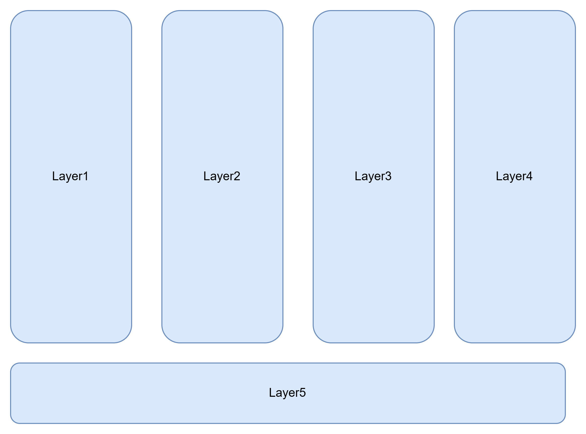

**This repo is for Architect Level Discussions and Learnings.**
===============================================================

**What are cloud-native applications?**
---------------------------------------
* Cloud-native applications are software programs that consist of multiple small, 
  interdependent services called microservices. 
* Traditionally, developers built monolithic applications with a single block structure 
  containing all the required functionalities. 
* By using the cloud-native approach, software developers break the functionalities into 
  smaller microservices. 
* This makes cloud-native applications more agile as these microservices work independently 
  and take minimal computing resources to run.

**Cloud-native applications compared to traditional enterprise applications**
------------------------------------------------------------------------------
* Traditional enterprise applications were built using less flexible software development 
  methods. 
* Developers typically worked on a large batch of software functionalities before releasing 
  them for testing. 
* As such, traditional enterprise applications took longer to deploy and were not scalable.
* On the other hand, cloud-native applications use a collaborative approach and are highly 
  scalable on different platforms. 
* Developers use software tools to heavily automate building, testing, and deploying procedures
  in cloud-native applications. 
* You can set up, deploy, or duplicate microservices in an instant, an action that's not 
  possible with traditional applications. 

**what is regression testing**
-------------------------------

Testing of new code or bug fixes to check if those fixes are impacting any other functionality 
of application

**Tools and Utilities which are provided by Cloud Natives are**
---------------------------------------------------------------
    CI/CD
    Jenkins
    Containers
    Microservices
    Data Bases
    Automated Build
    Automated Deployment
    Orchestration Service like kubernetes

**What is cloud-enabled?**

    Cloud-enabled applications are legacy enterprise applications that were running on an 
    on-premises data center but have been modified to run on the cloud. 
    
    This involves changing part of the software module to migrate the application to 
    cloud servers. You can thus use the application from a browser while retaining 
    its original features.
    Using cloud enabled we cannot leverage the features of scalability, flexibility and resilience , 
    latency handling.

**Cloud native compared to cloud enabled**

    The term cloud native refers to an application that was designed to reside in the cloud 
    from the start. Cloud native involves cloud technologies like 
    microservices, container orchestrators, and auto scaling. 
    A cloud-enabled application doesn't have the flexibility, resiliency, or scalability of its 
    cloud-native counterpart.

    This is because cloud-enabled applications retain their monolithic structure even 
    though they have moved to the cloud.

**What are the bottlenecks of microservice architecture**

    Unlike monolithic applications, microservices communicate over a network (usually via 
    REST APIs, gRPC, or messaging queues). If these calls are slow, the whole application 
    feels sluggish.

    Few More Bottlenecks are below

1. **Communication Overhead**
   Microservices interact over the network, which introduces latency and increased response times compared to monolithic architectures.
   Network failures and serialization/deserialization costs can slow down performance.
2. **Data Management Complexity**
   Each microservice may have its own database, leading to data inconsistency and distributed data management challenges.
   Cross-service transactions (e.g., distributed transactions using Saga pattern) can be complex and slow.
3. **Dependency Management**
   Versioning and compatibility issues arise when different services evolve at different speeds.
   Backward compatibility needs to be maintained, making updates slower.
4. **Service Discovery & Load Balancing**
   Identifying the right service instance (especially in a dynamic cloud environment) can be a challenge.
   Load balancing between instances must be handled efficiently to prevent uneven workload distribution.
5. **Monitoring & Debugging**
   Since requests span multiple services, tracking an issue requires distributed tracing.
   Centralized logging and monitoring are necessary but add complexity.
6. **Deployment & Configuration Management**
   Deploying multiple microservices independently requires robust CI/CD pipelines.
   Configuration management across multiple services can become difficult.
7. **Security Risks**
   Microservices expose multiple endpoints, increasing the attack surface.
   Ensuring secure authentication and authorization across services (e.g., using OAuth, JWT) adds overhead.
8. **Resource Utilization**
   Running multiple services means higher CPU, memory, and networking overhead.
   Inefficient scaling strategies can lead to resource wastage.

**Why It Happens:**

    •	Too many synchronous (blocking) API calls
    •	Network latency
    •	High dependency between services

**How to Fix It:**

    ✅ Use asynchronous communication (e.g., Kafka, RabbitMQ) to avoid waiting for responses
    ✅ Reduce unnecessary inter-service calls (combine multiple calls into one if possible)
    ✅ Implement caching to avoid calling another service for the same data repeatedly
    ✅ Design should adhere proper principles of DDD as poor DDD will lead to performance 
        issues in microservices.
    ✅ To prevent bottlenecks in a microservice architecture, it's crucial to define clear 
        boundaries between services. Each microservice should have a single responsibility and 
        manage its own data domain. 
        This approach, known as the Single Responsibility Principle, reduces the likelihood of 
        tightly coupled services that can create a domino effect of delays when one service experiences issues. 
        By maintaining loose coupling and high cohesion within services, 
        you enhance the system's resilience and agility
     ✅ Use Saga Pattern or Orchestration Strategy to handle distributed transactions.
     ✅ Use Database per Service pattern
     ✅ Maintain API contracts using OpenAPI (Swagger) to track changes.
     ✅ Use service meshes (Istio, Linkerd) for better service-to-service communication.
     ✅ Use Service Discovery Tools like Consul, Eureka, or Kubernetes Service Discovery to dynamically locate services.
     ✅ Use CI/CD pipelines (Jenkins, GitHub Actions, GitLab CI) to automate deployment.
     ✅ Use OAuth 2.0 & JWT for secure authentication and authorization.
     ✅ Implement API Gateway with rate limiting and WAF (Web Application Firewall).
     ✅ Use Auto-scaling (Kubernetes HPA, AWS Auto Scaling) to allocate resources dynamically.
     ✅ Implement Serverless Architectures where applicable (AWS Lambda, Azure Functions).

Kubernetes is container orchestration service
it scales up and down the docker applications.
Automatically deploys applications in on premises and cloud environments
it works as service discovery and load balancing the applications.

**Below Principles Should be followed while designing DDD or Microservice**

    Define Boundaries  -Single responsibility principle

    Decouple Services - Achieve this by using asynchronous communication between services.

    Implement APIs - Utilizing Application Programming Interfaces (APIs) effectively is a key strategy in managing 
                 microservice dependencies. Use backward compatibility so if any updates going this 
                 will not impact any flow 

    Monitor Traffic - Monitoring traffic flow between microservices is critical for identifying and addressing bottlenecks. Implementing a monitoring solution that provides real-time insights into service interactions can 
                        help you detect issues early and respond promptly.

    Scale Dynamically - Dynamic scaling is a powerful tool in preventing bottlenecks in a microservice 
                        architecture. By using container orchestration platforms like Kubernetes, 
                        you can automatically scale services up or down based on demand.

    Use Circuit Breakers - Implementing circuit breakers is an effective way to manage microservice dependencies and prevent bottlenecks. 
                            A circuit breaker is a design pattern that monitors for failures and temporarily disables service operations if a 
                            threshold of errors is reached, allowing the system to continue functioning while the issue is resolved. 
                            This prevents failures from cascading across services and creating system-wide bottlenecks.

**What is API Gateway and why it is useful for AWS Cloud Infrastructure**
-------------------------------------------------------------------------
API Gateway reduces too many Interservice call
API Gateway manages the  rate limiting and WAF (Web Application Firewall).
API Gateway: Aggregate requests and reduce multiple calls using tools like Kong, Apigee, 
            or AWS API Gateway.
API gateway - manages all security at one place.
API gateway helps in routing the traffic

**How Oauth works in API security**
-----------------------------------
Refer the diagram below to understand the flow

There are mainly below parties involved in authorization process

Application
Authorisation server
Resources - which are protected
End user

**Potential pitfalls in the development of Event-driven architecture**
----------------------------------------------------------------------

Event-driven architectures, especially as they grow in complexity with more producers and consumers,
can encounter a series of challenges:

1. Only some systems need granularity and complexity.Avoid micro-optimizations and over-segmenting 
    your architecture. Start simple and evolve as needed.
2. Sometimes, developers break down services or events too much. 
   This can lead to a “chatty” system where components communicate excessively over the network, 
   causing overhead.
3. Maintaining a state can be challenging in a distributed event-driven system. 
   If order matters, consider using stateful stream processing solutions or sequence numbers in events to reconstruct the proper order.
4. Ensure that event handlers are idempotent, meaning they can process the same message more 
   than once without side effects.
5. Statelessness: Design your event consumers to be stateless whenever possible, meaning a repeated 
   event will not produce a different outcome.
6. Unique Event IDs: Assign unique IDs to events. Before processing an event, check if its ID has 
   been processed recently to prevent duplicate processing.
7. You risk losing data without a way to handle events that can’t be processed. Dead-letter queues capture these events so they can be analyzed and acted upon.
8. Ensure Proper Logging , monitoring and tracing.

**where to use EDD**
---------------------
In stock market or trading platforms where notifications is meaning ful.
where real time processing are needed.
In bigger application where plenty of microservices are there to communicate each other.

**Rabbit MQ or Kafka**
----------------------
This is preferred when very few microservices are there for communication and aysnchronous 
messaging is needed we can still achieve decoupling and resilence.

**What is SAGA Design Pattern and where to use it**
---------------------------------------------------
SAGA Design Pattern is used for distributed applications.For legacy or traditional system 
we use 2 Phase Commit which means transaction has to be completed in 2 phases
1. First commit the Changes. 
2. second either commit or abort the changes.

Problems with Traditional Distributed Transaction Protocols

Blocking Nature: If the coordinator fails after initiating the transaction, participants may be left waiting indefinitely, causing delays.
Single Points of Failure: The coordinator is crucial for decision-making. If it crashes, the entire transaction can get stuck, impacting reliability.
Network Partitions: If the network splits, some nodes might not receive the final decision, 
leading to inconsistent states (i.e., some nodes might commit while others don’t), which causes 
data inconsistency.

These problems make 2PC unsuitable for modern, highly available, and fault-tolerant systems.

**Example of SAGA Design Pattern**
----------------------------------

Let’s understand how SAGA works using the example of an e-commerce order process with the SAGA Execution Coordinator and SAGA Log.

Step 1: Create Order: Reserve the product.
Step 2: Process Payment: Charge the customer’s card.
Step 3: Update Inventory: Reduce the stock.
Step 4: Deliver Order: Ship the product to the customer.

Start the SAGA:
The process begins by executing the first step in the sequence.
Execute Step 1:
The system performs the first sub-transaction (e.g., creating the order and reserving the product). If this step is successful, move to Step 2. If it fails, trigger its compensating action (e.g., cancel the order) and stop.
Execute Step 2:
If Step 1 was successful, the next step (e.g., process the payment) is executed. If Step 2 fails (e.g., payment is declined), its compensating action (e.g., refund the payment) is triggered, and Step 1’s compensating action (e.g., unreserve the product) is also executed.
Execute Step 3:
If Step 2 was successful, proceed to the next step (e.g., update inventory). If Step 3 fails, its compensating action (e.g., reverse inventory update) is triggered, and Step 2’s compensating action (e.g., refund payment) is executed.
Execute Step 4:
Finally, if all previous steps are successful, the last step (e.g., deliver the order) is executed. If any prior step has failed, its compensating actions are triggered, ensuring the system remains consistent.

**Advantages of SAGA Pattern**
------------------------------
With SAGA, if one step fails, the entire process can be rolled back or compensated without affecting
other steps.
SAGA can support asynchronous processing, allowing for greater concurrency and performance.
SAGA can handle transactions across multiple services or databases, 
allowing for more scalable and distributed architectures.

**Disadvantages of SAGA Pattern**
---------------------------------
Implementing SAGA requires additional coding and architecture to handle compensation and 
rollback steps.
Not all frameworks or platforms support SAGA out of the box, 
which can make implementation more difficult.
The SAGA pattern requires careful design to ensure that the compensations and 
rollbacks are implemented correctly and can handle all possible failure scenarios.

**What is TOGAF Architectural principles**
------------------------------------------

The Open Group Architecture Framework (TOGAF).TOGAF is a high-level approach to design.
It is typically modeled at four levels: Business, Application, Data, and Technology.
It relies heavily on modularization, standardization, and 
already existing, proven technologies and products.

Before you architect something we need to understand 4 domains-

1. Business - How business works in the organisation.what are the key business 
    processes of the organization.
2. Data - Understand legacy or existing data assets
3. Applications - Blueprints of the existing application work 
4. Technology- what is the technology infrastructure is being used to support tech deployment.

**What is SOA**
---------------
Service-Oriented Architecture (SOA) is an architectural style where software components are 
developed as loosely coupled services that communicate over a network. These services are reusable, 
interoperable, and independent, promoting modular development.

**Microservices vs SOA**
-------------------------
* SOA focuses on reusable enterprise-level services, while Microservices focus on smaller, 
  independently deployable services.

* SOA typically uses an ESB, while Microservices use lightweight communication like REST or 
  message queues (Kafka, RabbitMQ).

* SOA is still used in Enterprize architecture where service communications are established via 
    ESB and ESB plays an important role in service communication.ESB is centralized hub.
    SOA are centralized by ESB where as Microservices are decentralized
  SOA are hardly scalable but Microservices are highly scalable.
* SOA is good for Large enterprize systems with legacy integration but M/S are good for independant 
    services, modern and cloud native applications.

**When to Choose SOA?**
-----------------------
Your organization has legacy systems that need integration.
✅ You need enterprise-level governance and central control.
✅ Your business deals with multiple applications that need to communicate efficiently 
    (e.g., banking, healthcare, government systems).
✅ Security and standardized protocols (SOAP, WSDL, XML) are critical.

💡 Example: Large banking institutions, ERPs, and government services often use SOA.

**API Security**
------------------

Below are the options which can be used for security in microservices

1. Authentication
Basic Auth - Not Recommended unless HTTPS.
Token Based - JWT or oAuth
mTLS - 2 way authentication
2. Authorisation
Role based or policy based control is Authorisation

**Basic Auth - How it works** Not Recommended
---------------------------------------------

1. Client sends the username and password in encoded form ,server decodes the credentials and identify
2. Highly not recommended as it is not scalable across all microservices
3. vulnerable if not used in HTTPS protocol.

**Recommended security in microservices for scalable and secure**
-----------------------------------------------------------------
oAUth2+JWT
mTLS for service to service communications

**Difference between OAuth and Oauth 2**
-----------------------------------------
oAUth and ouaTH2 both are strictly authorization framework only not authentication.
To add authentication also you can add OpenID COnnect with OAuth.

**E2E SDLC Life Cycle**
------------------------

1. Requirement Gathering  and analysis 
2. Planning - Resource planning, Estimation, risk management
3. System design and architecture
4. Development
5. Testing
6. Deployment
7. Maintenance and support

**what are the non functional requirement**
--------------------------------------------
Performance
Availability
Scalability

**How will you develop the scalable microservices for high traffic day**
-------------------------------------------------------------------------
To build scalable microservice

1. Define boundaries as per requirement and business
2. Define services as loosely coupled and highly cohesive(single responsibility)
3. Avoid chatty communicaiton
4. Define stateless microservices(if statefull you can use redis)
5. for asynchronous communication use kafka,rabbitmQ or SNS/SQS in case of AWS also you can 
   use event driven architecture
6. Use CQRS design Pattern for decouling of read and write operations
7. Use NOSQL for schema less and flexible schema
8. Use docker containers for deployment Use kubernetes for orchestration , auto scaling or service discovery
9. Use resillience 4J for cirocuit breaker or retries mechanism
10. Use API gateway for centralized control
11. Use ELK for distributed logging

**How will you handle performance bottlenecks in java application**
-------------------------------------------------------------------
1.YOU can use JProfiler tool to understand the bottlenecks.
2. you can analyse the DB response times and check which query is running slow or very late response
3. you can check if thread issues are there.
4. Use caching or lazy loading where ever its needed
5. Use Executorservice for multithreading
6. Use supplier interface for laxy loading
7. use parallel stream for multiprocessing
8. Add indexes in DB and use optmized queries

**Key principles of software architecture**
---------------------------------------------
Goal - Minimize complexity with fulfilling all the business requirment

This can be achieved by providing layered architecture or seperating the area of concerns
you can create groups of all the concerns and create a layer of these.
 
diagram below

These areas should have single responsibilities.

**5 Key Principles of Architecture**
-------------------------------------
1. separation of concerns
2. single responsibility
3. principle of least knowledge - Each component should have minimum knowledge only about other component
                                   They should ahve access to publi members 
                                    They should be achieved by interfaces only
4. Don't repeat your self - like suppose if you are using caching components then this component 
                             should reusable accross everywhere.
5. Minimize upfront design - Start with the initial design as minimum as you can and keep incrementing that design
                             better as you have more clarity on details requirement.

**General guidelines for software architecture**
------------------------------------------------
1. Use consistent pattern in each layer. like dont use MVC and MVVMV pattern in spring.Either 
   use MVC or either use MVVM not mix.
2. do not duplicate functionality
3. prefer composition over inheritence
4. Establish a code convention - Define what would be the code standards like camlecase or some other convention.
5. use abstraction 

**UML**
-------
To define the visualize flow of system design.
2 Models which we create to define the system.

Business System Model - Non technical
IT Model - Technical

**UML Diagrams**
----------------
Component diagram - show components and impl and interfaces

class diagram - classes , associations,methods and field details

sequence diagram - class sequence diagram

state diagram - show states and activities and transitions.

activity diagram - show process workflow,decisions etc.

layer diagram - 

use case diagram

**UML Diagram Linking with Architecture**
-----------------------------------------
Which UML diagram is used for whcih architecture preparation?

Funcational Requirmeent - Use Case diagram
Structural elements/Composition - Class diagram/Component diagram
Structural elements/Collaboration - Sequence diagram/Activity diagram/State diagram
area concern - layer diagram

**Architecture Design Process**
-------------------------------
Create Objectives
Identify key scenarios
Create Overview
Identify key issues
Create candidate solutions

**Architectural Design Patterns**
----------------------------------
Layered Pattern - Client and server pattern
Structured Pattern - 
Presentation Architecture Pattern - Use MVC architecture so that Model, View and 
Controller can be decoupled from each other.
Service Architecture Pattern - Isolate and write decoupled service.
Hybrid Architecture Pattern

-------------------------------------------

**Difference between logging and tracing**
------------------------------------------
logging - Finding any issues or errors in each component
tracing - Tracking the flow of requests as they move through various components and
services within a distributed system. it shows how many request failed with what error,
what was the response time, what was the response code, duration of the whole request,
successful request, method requested.

Distributed tracing consists of two main concepts

Trace Id(same as correlation id) -is used to trace an incoming request and track it across all the composing services to satisfy a request
Span Id - spans in between service calls to track each request that is received and to the response that is sent out.

Tools and utilities which can be used for distributed logging in microservices
----------------------------------------------------------------------------------------------
Solution 1 - Use elastic search and kibana option
-----------
Elastic Search is one of the best tools for distributed logging on microservices architectures.
Elasticsearch is the preferred full-text search search engine in processes such as content search,
data analysis, queries and suggestions, especially due to its performance capabilities, powerful and
flexible features.

**Elastic search**
1. Elasticsearch is a distributed, open source search and analytics engine. If you need security and alert features with Kibana, then it is required to purchase commercial pack.
2. Elasticsearch is an open source database that is well suited for indexing logs and analytical data.
3. It is developed in Java and is based on Apache Lucene
4. Elastic-search has a restful API which brings result for its open source database.
5. it is scalable and easy to install.
6. Elasticsearch is fast
7. Elastic Search is made with high speed and high availability.

**Kibana**
its a user interface to fetch results from Elastic search
it calls Elastic Search API to fetch results from search engine.

Solution 2 - using spring-cloud-sleuth and spring-cloud-zipkin
--------------------------------------------------------------

**How logging is handled in MAE**
---------------------------------

we have enabled AWS X-Ray. Utility PL runs by devops team who has enabled XRay for each cell.
we are following below approach in MAE-

**Approach 1** - Using tracing we can get responses,latency , failure , successful call details.
------------------------------------------------------------------------------------------------
1. Added @Tracing(segmentname="") in controller method only, no where else.This is coming from aws sk jar
   named powertool tracing jar.
2. What ever the segment name is provided in the name the same is tracked in cloud watch logs.
3. Add below in orchestrator file in the start of method which starts a segment
   AWSXRay.beginSegment("AIP_OTHER_PROPERTY_MORTGAGE_SEGMENT")
   in the end of method
   AWSXRay.endSegment()

This apporach is also good to understand the memory optimizer of lambda.

**Approach 2**
--------------
use log.info,log.debug,log.error which provides 

**Scrum Ceremonies**
--------------------

Story Points in Jira

XS (1), S (2), M (3), L (5), XL (8), XXL (13).

we don't go beyond 13

