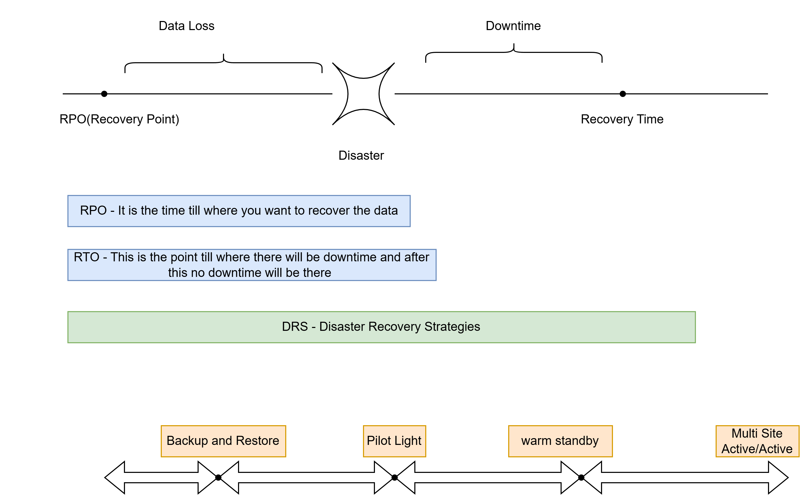
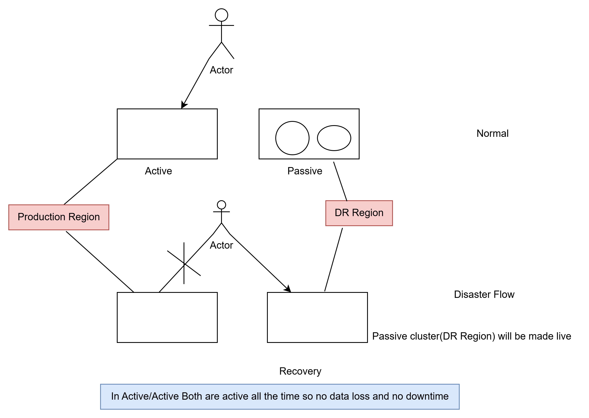
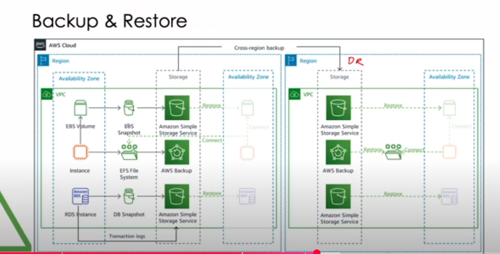
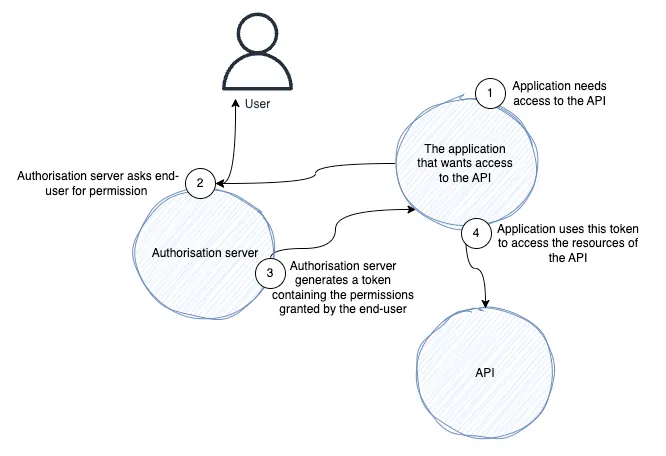
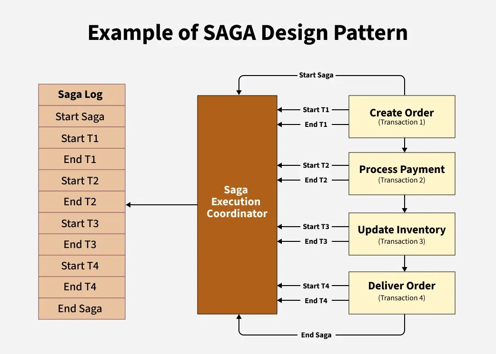

**This repo is for Architect Level Discussions and Learnings.**
===============================================================

**What are cloud-native applications?**
---------------------------------------
* Cloud-native applications are software programs that consist of multiple small, 
  interdependent services called microservices. 
* Traditionally, developers built monolithic applications with a single block structure 
  containing all the required functionalities. 
* By using the cloud-native approach, software developers break the functionalities into 
  smaller microservices. 
* This makes cloud-native applications more agile as these microservices work independently 
  and take minimal computing resources to run.

**Cloud-native applications compared to traditional enterprise applications**
------------------------------------------------------------------------------
* Traditional enterprise applications were built using less flexible software development 
  methods. 
* Developers typically worked on a large batch of software functionalities before releasing 
  them for testing. 
* As such, traditional enterprise applications took longer to deploy and were not scalable.
* On the other hand, cloud-native applications use a collaborative approach and are highly 
  scalable on different platforms. 
* Developers use software tools to heavily automate building, testing, and deploying procedures
  in cloud-native applications. 
* You can set up, deploy, or duplicate microservices in an instant, an action that's not 
  possible with traditional applications. 

**what is regression testing**
-------------------------------

Testing of new code or bug fixes to check if those fixes are impacting any other functionality 
of application

**Tools and Utilities which are provided by Cloud Natives are**
---------------------------------------------------------------
    CI/CD
    Jenkins
    Containers
    Microservices
    Data Bases
    Automated Build
    Automated Deployment
    Orchestration Service like kubernetes

**What is cloud-enabled?**

    Cloud-enabled applications are legacy enterprise applications that were running on an 
    on-premises data center but have been modified to run on the cloud. 
    
    This involves changing part of the software module to migrate the application to 
    cloud servers. You can thus use the application from a browser while retaining 
    its original features.
    Using cloud enabled we cannot leverage the features of scalability, flexibility and resilience , 
    latency handling.

**Cloud native compared to cloud enabled**

    The term cloud native refers to an application that was designed to reside in the cloud 
    from the start. Cloud native involves cloud technologies like 
    microservices, container orchestrators, and auto scaling. 
    A cloud-enabled application doesn't have the flexibility, resiliency, or scalability of its 
    cloud-native counterpart.

    This is because cloud-enabled applications retain their monolithic structure even 
    though they have moved to the cloud.

**What are the bottlenecks of microservice architecture**

    Unlike monolithic applications, microservices communicate over a network (usually via 
    REST APIs, gRPC, or messaging queues). If these calls are slow, the whole application 
    feels sluggish.

    Few More Bottlenecks are below

1. **Communication Overhead**
   Microservices interact over the network, which introduces latency and increased response times compared to monolithic architectures.
   Network failures and serialization/deserialization costs can slow down performance.
2. **Data Management Complexity**
   Each microservice may have its own database, leading to data inconsistency and distributed data management challenges.
   Cross-service transactions (e.g., distributed transactions using Saga pattern) can be complex and slow.
3. **Dependency Management**
   Versioning and compatibility issues arise when different services evolve at different speeds.
   Backward compatibility needs to be maintained, making updates slower.
4. **Service Discovery & Load Balancing**
   Identifying the right service instance (especially in a dynamic cloud environment) can be a challenge.
   Load balancing between instances must be handled efficiently to prevent uneven workload distribution.
5. **Monitoring & Debugging**
   Since requests span multiple services, tracking an issue requires distributed tracing.
   Centralized logging and monitoring are necessary but add complexity.
6. **Deployment & Configuration Management**
   Deploying multiple microservices independently requires robust CI/CD pipelines.
   Configuration management across multiple services can become difficult.
7. **Security Risks**
   Microservices expose multiple endpoints, increasing the attack surface.
   Ensuring secure authentication and authorization across services (e.g., using OAuth, JWT) adds overhead.
8. **Resource Utilization**
   Running multiple services means higher CPU, memory, and networking overhead.
   Inefficient scaling strategies can lead to resource wastage.

**Why It Happens:**

    •	Too many synchronous (blocking) API calls
    •	Network latency
    •	High dependency between services

**How to Fix It:**

    ✅ Use asynchronous communication (e.g., Kafka, RabbitMQ) to avoid waiting for responses
    ✅ Reduce unnecessary inter-service calls (combine multiple calls into one if possible)
    ✅ Implement caching to avoid calling another service for the same data repeatedly
    ✅ Design should adhere proper principles of DDD as poor DDD will lead to performance 
        issues in microservices.
    ✅ To prevent bottlenecks in a microservice architecture, it's crucial to define clear 
        boundaries between services. Each microservice should have a single responsibility and 
        manage its own data domain. 
        This approach, known as the Single Responsibility Principle, reduces the likelihood of 
        tightly coupled services that can create a domino effect of delays when one service experiences issues. 
        By maintaining loose coupling and high cohesion within services, 
        you enhance the system's resilience and agility
     ✅ Use Saga Pattern or Orchestration Strategy to handle distributed transactions.
     ✅ Use Database per Service pattern
     ✅ Maintain API contracts using OpenAPI (Swagger) to track changes.
     ✅ Use service meshes (Istio, Linkerd) for better service-to-service communication.
     ✅ Use Service Discovery Tools like Consul, Eureka, or Kubernetes Service Discovery to dynamically locate services.
     ✅ Use CI/CD pipelines (Jenkins, GitHub Actions, GitLab CI) to automate deployment.
     ✅ Use OAuth 2.0 & JWT for secure authentication and authorization.
     ✅ Implement API Gateway with rate limiting and WAF (Web Application Firewall).
     ✅ Use Auto-scaling (Kubernetes HPA, AWS Auto Scaling) to allocate resources dynamically.
     ✅ Implement Serverless Architectures where applicable (AWS Lambda, Azure Functions).

**Below Principles Should be followed while designing DDD or Microservice**

    Define Boundaries  -Single responsibility principle

    Decouple Services - Achieve this by using asynchronous communication between services.

    Implement APIs - Utilizing Application Programming Interfaces (APIs) effectively is a key strategy in managing 
                 microservice dependencies. Use backward compatibility so if any updates going this 
                 will not impact any flow 

    Monitor Traffic - Monitoring traffic flow between microservices is critical for identifying and addressing bottlenecks. Implementing a monitoring solution that provides real-time insights into service interactions can 
                        help you detect issues early and respond promptly.

    Scale Dynamically - Dynamic scaling is a powerful tool in preventing bottlenecks in a microservice 
                        architecture. By using container orchestration platforms like Kubernetes, 
                        you can automatically scale services up or down based on demand.

    Use Circuit Breakers - Implementing circuit breakers is an effective way to manage microservice dependencies and prevent bottlenecks. 
                            A circuit breaker is a design pattern that monitors for failures and temporarily disables service operations if a 
                            threshold of errors is reached, allowing the system to continue functioning while the issue is resolved. 
                            This prevents failures from cascading across services and creating system-wide bottlenecks.

**AWS Disaster Recovery Architecture and Strategies**
------------------------------------------------------

https://www.youtube.com/watch?v=_4hESnziWIE

1. Different Strategies for AWS Disaster Recovery

**Backup and Restore(active/passive)**
--------------------------------------
* active/passive means production servers will be active and DSR servers will be passive
* active/active means production and DSR servers will be active both.
* cheapest option
* will take hours to restore
* it will take backup and restore

**Pilot light(active/passive)**
--------------------------------
1. Much Faster compared to back up and restore
2. More Costlier than back up and restore
3. Can restore live data

**warm standby(active/passive)**
--------------------------------
1. preety fast than previous two options
2. Always running but for smaller business and for critical business.
3. More costlier than other 2s.

**Multi site(active/active)**
-----------------------------
* zero downtime
* zero data loss
* mission critical service
* high costly
* always running

we will study how this DSR works but before that we need to understand few terms before moving ahead.

**what is EBS Volume**
----------------------

* An Amazon EBS (Elastic Block Storage) volume is a durable, block-level storage device that you can attach to your Amazon 
  EC2 instances, acting like a virtual hard drive for persistent storage
* EBS volumes store data persistently, meaning the data remains even if the EC2 instance is 
  stopped or terminated.
* You can attach EBS volumes to EC2 instances, allowing you to extend the storage capacity of 
  your virtual machines.
* EBS volumes are replicated within an Availability Zone to ensure high availability and durability.

**what is EBS Snapshot**
-------------------------
* An Amazon EBS (Elastic Block Storage) snapshot in AWS is a point-in-time copy of an EBS volume, 
  acting as a backup that can be used for data protection, disaster recovery, and migrating data.
* An EBS snapshot is a backup of your EBS volume, which is a virtual hard drive for your Amazon EC2 
  instances.

**what is EFS File System**
---------------------------
Amazon Elastic File System (EFS) is a serverless, fully elastic file storage service that allows you to 
share files across multiple AWS compute instances and on-premises servers, without needing to 
provision or manage storage capacity

**what is DB Snapshot**
-----------------------
In AWS, a DB snapshot is a point-in-time backup of a relational database instance, 
capturing all data and configuration settings, allowing for quick recovery or restoration to a 
specific state.

**Backup and restore Strategies** 
---------------------------------

**How to run spring boot application in aws**
---------------------------------------------
1. One way
------------
create spring boot application and prepare jar
create one EC2 instance and get the public IPV4 DNS address
using this address as above get login to EC2 instance using ppk auth
copy jar to ec2 instance using winscp
run the jar in ec2 instance and using the IPV4 address hit the address and check the URL

2.Second way
-------------
create spring boot jar and add in to your docker.
Create one task definitions and add docker image to this task.
Create one task and add above tasks def in to it.
Create one service and add same task as above.
create one ECS cluster and add above service to this ECS.

Once ECS is created wait for service to get up and use public URL and hit in browser , it shud be runnblae.

**AWS Region , AZ and VPC**
----------------------------

**Difference between EC2 on ECS and Fargate on ECS**
--------------------------------------------------

EC2 is mainly VM Machines or compute services where as ECS is used to orchestrate EC2 instances.You can run ECS containers on EC2 instances, or on AWS Fargate, 
a serverless compute engine. AWS Fargate is a serverless compute engine that you can use with ECS to run containers without managing servers or clusters of EC2 instances.

ECS stands for “Elastic Container Service.” Where EC2 uses virtualization and virtual machines (VMs), Amazon ECS is used to manage Docker container applications. 
It is a fully managed container orchestration service that functions in similar fashion to Kubernetes. Amazon ECS orchestrates Docker containers running via Amazon EC2.
Rather than deploying a new EC2 instance to scale up, Amazon ECS uses container clusters. Each cluster contains multiple EC2 instances, governed by the Amazon ECS orchestrator 
to facilitate scaling and failovers. ECS works like a control plane only.
In summary, ECS allows companies to deploy containerized applications and orchestrate them easily, without the infrastructure management burden.

when we create any tasks def on ECS cluster it asks for launch types which are of 2 types
1. Fargate  - ECS will manage all the EC2 instances and you dont need to manage at your won.Fargate will provision EC2 instances as per demand and requriement.                                 
2. EC2 instances - you will need to manage everything at your own like security groups , etc.

when you opt EC2 it's a kind of independent instances which are running your docker images but its not managed ones , you need to manage the capacity , memory, security 
patching AMIs and all will be taken care by you as you are the driver.

when you opt Fargate then its same as serverless lambda functions where you will tell ECS how many docker images you need to run and all will be 
taken care by AWS to find and run EC2 instances for you as per your requirement.

**EKS vs ECS**
--------------
https://www.youtube.com/watch?v=o73kDW0xqlg&t=45s

ECS and EKS are the container services which are used to manage the containers.
Lest suppose you have 4-5 microservices whcih you wanted to dpeloy on AWS using each service in one container. you have chosen EC2 server to deploy these containers in to it.
But what happen when EC2 server limitation reaches if we need to deploy our next container?
who manages these EC2 available resources?
what happen when container crashes?
in peak hours how would you scale up and scale down instances during peak and low traffic?
Load balancing the traffic?

Difference between ECS and EKS

ECS is like control plane and works like a side car.
EKS - <will discuss >

**What is API Gateway and why it is useful for AWS Cloud Infrastructure**
-------------------------------------------------------------------------
API Gateway reduces too many Interservice call
API Gateway manages the  rate limiting and WAF (Web Application Firewall).
API Gateway: Aggregate requests and reduce multiple calls using tools like Kong, Apigee, 
            or AWS API Gateway.
API gateway - manages all security at one place.
API gateway helps in routing the traffic

**How Oauth works in API security**
-----------------------------------
Refer the diagram below to understand the flow

There are mainly below parties involved in authorization process

Application
Authorisation server
Resources - which are protected
End user

**Potential pitfalls in the development of Event-driven architecture**
----------------------------------------------------------------------

Event-driven architectures, especially as they grow in complexity with more producers and consumers,
can encounter a series of challenges:

1. Only some systems need granularity and complexity.Avoid micro-optimizations and over-segmenting your architecture. Start simple and evolve as needed.
2. Sometimes, developers break down services or events too much. This can lead to a “chatty” system where components communicate excessively over the network, causing overhead.
3. Maintaining a state can be challenging in a distributed event-driven system. If order matters, consider using stateful stream processing solutions or sequence numbers in events to reconstruct the proper order.
4. Ensure that event handlers are idempotent, meaning they can process the same message more than once without side effects.
5. Statelessness: Design your event consumers to be stateless whenever possible, meaning a repeated 
   event will not produce a different outcome.
6. Unique Event IDs: Assign unique IDs to events. Before processing an event, check if its ID has 
   been processed recently to prevent duplicate processing.
7. You risk losing data without a way to handle events that can’t be processed. Dead-letter queues capture these events so they can be analyzed and acted upon.
8. Ensure Proper Logging , monitoring and tracing.

**where to use EDD**
---------------------
In stock market or trading platforms where notifications is meaning ful.
where real time processing are needed.
In bigger application where plenty of microservices are there to communicate each other.

**Rabbit MQ or Kafka**
----------------------
This is preferred when very few microservices are there for communication and aysnchronous 
messaging is needed we can still achieve decoupling and resilence.

**What is SAGA Design Pattern and where to use it**
---------------------------------------------------
SAGA Design Pattern is used for distributed applications.For legacy or traditional system 
we use 2 Phase Commit which means transaction has to be completed in 2 phases
1. First commit the Changes. 
2. second either commit or abort the changes.

Problems with Traditional Distributed Transaction Protocols

Blocking Nature: If the coordinator fails after initiating the transaction, participants may be left waiting indefinitely, causing delays.
Single Points of Failure: The coordinator is crucial for decision-making. If it crashes, the entire transaction can get stuck, impacting reliability.
Network Partitions: If the network splits, some nodes might not receive the final decision, 
leading to inconsistent states (i.e., some nodes might commit while others don’t), which causes 
data inconsistency.

These problems make 2PC unsuitable for modern, highly available, and fault-tolerant systems.

**Example of SAGA Design Pattern**
----------------------------------

Let’s understand how SAGA works using the example of an e-commerce order process with the SAGA Execution Coordinator and SAGA Log.

Step 1: Create Order: Reserve the product.
Step 2: Process Payment: Charge the customer’s card.
Step 3: Update Inventory: Reduce the stock.
Step 4: Deliver Order: Ship the product to the customer.

Start the SAGA:
The process begins by executing the first step in the sequence.
Execute Step 1:
The system performs the first sub-transaction (e.g., creating the order and reserving the product). If this step is successful, move to Step 2. If it fails, trigger its compensating action (e.g., cancel the order) and stop.
Execute Step 2:
If Step 1 was successful, the next step (e.g., process the payment) is executed. If Step 2 fails (e.g., payment is declined), its compensating action (e.g., refund the payment) is triggered, and Step 1’s compensating action (e.g., unreserve the product) is also executed.
Execute Step 3:
If Step 2 was successful, proceed to the next step (e.g., update inventory). If Step 3 fails, its compensating action (e.g., reverse inventory update) is triggered, and Step 2’s compensating action (e.g., refund payment) is executed.
Execute Step 4:
Finally, if all previous steps are successful, the last step (e.g., deliver the order) is executed. If any prior step has failed, its compensating actions are triggered, ensuring the system remains consistent.

**Advantages of SAGA Pattern**
------------------------------
With SAGA, if one step fails, the entire process can be rolled back or compensated without affecting
other steps.
SAGA can support asynchronous processing, allowing for greater concurrency and performance.
SAGA can handle transactions across multiple services or databases, 
allowing for more scalable and distributed architectures.

**Disadvantages of SAGA Pattern**
---------------------------------
Implementing SAGA requires additional coding and architecture to handle compensation and rollback steps.
Not all frameworks or platforms support SAGA out of the box, which can make implementation more difficult.
The SAGA pattern requires careful design to ensure that the compensations and rollbacks are implemented correctly and can handle all possible failure scenarios.

**What is TOGAF Architectural principles**
------------------------------------------

The Open Group Architecture Framework (TOGAF).TOGAF is a high-level approach to design.
It is typically modeled at four levels: Business, Application, Data, and Technology.
It relies heavily on modularization, standardization, and 
already existing, proven technologies and products.

Before you architect something we need to understand 4 domains-

1. Business - How business works in the organisation.what are the key business 
    processes of the organization.
2. Data - Understand legacy or existing data assets
3. Applications - Blueprints of the existing application work 
4. Technology- what is the technology infrastructure is being used to support tech deployment.

**What is SOA**
---------------
Service-Oriented Architecture (SOA) is an architectural style where software components are 
developed as loosely coupled services that communicate over a network. These services are reusable, 
interoperable, and independent, promoting modular development.

**Microservices vs SOA**
-------------------------
* SOA focuses on reusable enterprise-level services, while Microservices focus on smaller, 
  independently deployable services.

* SOA typically uses an ESB, while Microservices use lightweight communication like REST or 
  message queues (Kafka, RabbitMQ).

* SOA is still used in Enterprize architecture where service communications are established via 
    ESB and ESB plays an important role in service communication.ESB is centralized hub.
    SOA are centralized by ESB where as Microservices are decentralized
  SOA are hardly scalable but Microservices are highly scalable.
* SOA is good for Large enterprize systems with legacy integration but M/S are good for independant 
    services, modern and cloud native applications.

**When to Choose SOA?**
-----------------------
Your organization has legacy systems that need integration.
✅ You need enterprise-level governance and central control.
✅ Your business deals with multiple applications that need to communicate efficiently (e.g., banking, healthcare, government systems).
✅ Security and standardized protocols (SOAP, WSDL, XML) are critical.

💡 Example: Large banking institutions, ERPs, and government services often use SOA.

**API Security**
----------------

