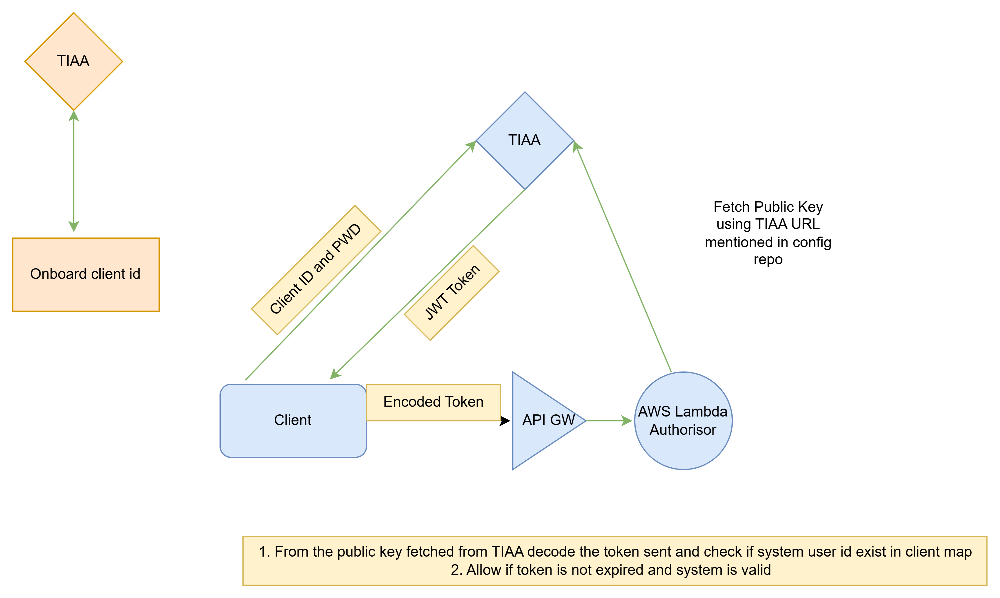

Architecture Flow of TIAA in MAE
---------------------------------

How TIAA works e2e flow

Great follow-up! The public/private key pair comes into play primarily in token signature validation, especially when JSON Web Tokens (JWTs) are used — which is very common in modern OAuth 2.0 and OpenID Connect implementations.

Here's where they fit in:

---

Where Public/Private Keys Are Used in REST API Authentication

1. Token Signing by Authorization Server

When TIAA’s Authorization Server issues a JWT access token, it often signs it using a private key (asymmetric cryptography — typically RSA or EC).

This ensures the token is tamper-proof and can be validated without calling the auth server again.

Example JWT:

eyJhbGciOiJSUzI1NiIsInR5cCI6IkpXVCJ9...

The header indicates it's signed with RS256 (RSA with SHA-256).

---

2. Token Validation by API Gateway or Resource Server

When your app calls TIAA's API with that JWT, the API Gateway or Resource Server uses the corresponding public key to verify the token's signature.

This confirms that:

The token was indeed issued by TIAA.

The token hasn’t been tampered with.

---

Where Do You Get the Public Key?

TIAA (or any OAuth provider) typically exposes a JWKS (JSON Web Key Set) endpoint.

Example:

https://auth.tiaa.com/.well-known/jwks.json

This endpoint provides the public keys used to verify JWTs.

---

Optional: mTLS (Mutual TLS)

In some high-security setups (common in finance), TIAA might also require client-side SSL certificates, where:

You (the API consumer) hold a private key and certificate.

TIAA’s gateway uses your public cert to verify your identity during TLS handshake.

This is more about transport-level security, while JWT keys are about token-level trust.

---

Summary:

---

Let me know if you want to go into JWT structure or a live example of how to validate a token signature!

